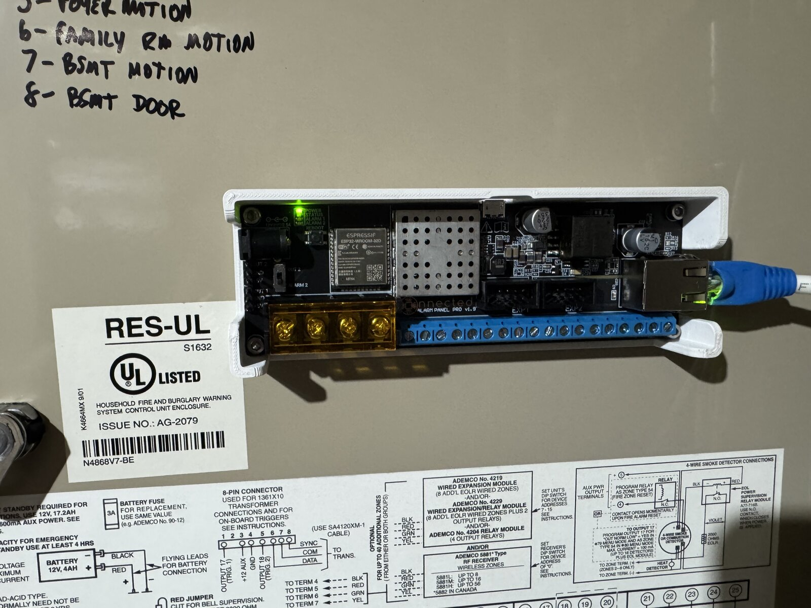
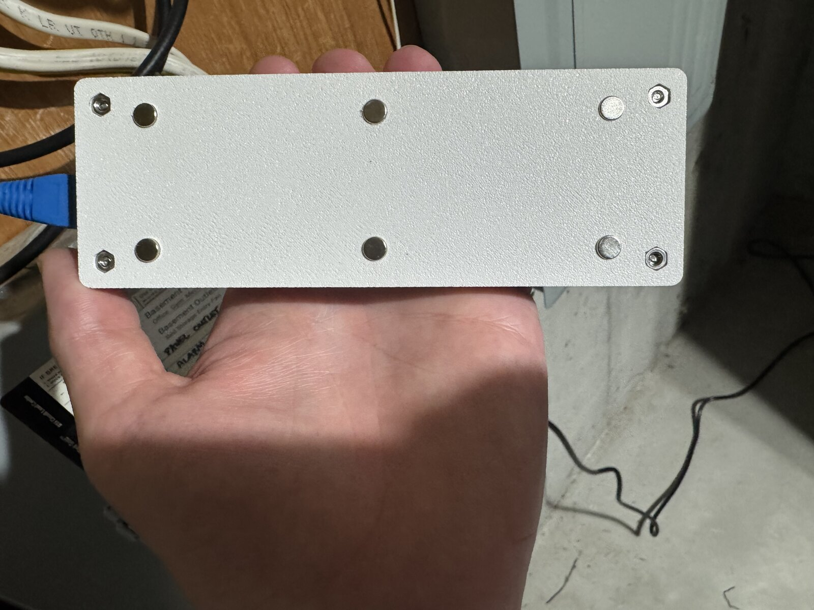

# Konnected Alarm Panel Pro Case — Magnetic Mount Remix

A remix of [zefer's Konnected Alarm Panel Pro Case](https://www.printables.com/model/680613-konnected-alarm-panel-pro-case)
that mounts magnetically inside a steel alarm panel enclosure — no screws, no
standoff hardware, no drilling. Six cheap 6×2.6mm neodymium disc magnets
press-fit and glue into pockets in the case base; the case snaps onto the
enclosure wall and pulls off by hand. A printed-in-place alternative to
[Konnected's magnetic standoffs](https://konnected.io/products/magnetic-standoffs)
that keeps the full protection of an enclosed case.



## What changed from the original

- Six magnet pockets cut into the underside of the base floor: four corners
  (±58, ±17) plus a mid-span pair (0, ±17) — a 116 × 34mm stance
- Each pocket: Ø6.20 × 2.45mm (magnet sits ~0.2mm proud, so the case stands on
  the magnet faces), with a low Ø9mm ceiling pad inside the case and a Ø2.5mm
  vent hole — air/glue escape during insertion, and an eject port if you ever
  need to poke a magnet back out
- The two woodscrew wall-mount holes and their interior bosses are removed —
  this base mounts magnetically only (use the original if you want screws)
- Lid and board mounting are unchanged: use zefer's lid and his M3
  nut/standoff/screw scheme



CAD renders of both faces are in [`previews/`](previews/).

## Bill of materials

- 6 × neodymium disc magnets, 6mm Ø × 2.6mm thick (common "6×2" packs often
  measure ~6.03 × 2.64 — caliper yours). No polarity concerns against steel.
- CA glue (a drop per pocket)
- Board mounting, per the original: 4 × M3 nuts, standoffs (e.g. M3×6+6), screws

## Printing & fit

The press-fit diameter depends on your printer's hole shrinkage, so
**print `magnet_fit_coupon.stl` first** (a few minutes): orient it pocket-openings
down / dot-marks up — the same orientation the pockets print in the base — and
press a magnet into each pocket. Dots 1–4 mark Ø6.10 / 6.20 / 6.30 / 6.40
(1 = tightest). Pick the snug-but-fully-seatable one; the vent hole lets you
poke the magnet out and reuse it. If your winner isn't Ø6.20, set `POCKET_D`
in `build_remix.py` and regenerate (see below).

Then print `konnected_base_magnetic.stl` flat, no supports (pocket ceilings are
short bridges — they print fine). 0.2mm PLA works; same settings as the original.

## Assembly

1. Drop of CA in each pocket, press the six magnets in until seated.
   Don't skip the glue — it's what resists pull-off when you remove the case
   from the enclosure wall.
2. Mount the board per the original case's instructions (M3 nuts in the corner
   pockets, standoffs, screws), add the lid.
3. Stick it to the inside of the enclosure.

Note Konnected's own caveat: a steel enclosure attenuates WiFi — fine if you
use the Pro's Ethernet, otherwise check signal strength.

## Regenerating the models

The geometry is script-built with [FreeCAD](https://www.freecad.org) (1.1.x)
from a STEP conversion of zefer's original base (included in `original/`):

```
freecadcmd build_remix.py    # -> konnected_base_magnetic.step + .stl
freecadcmd build_coupon.py   # -> magnet_fit_coupon.stl
```

All dimensions (station positions, pocket Ø/depth, pad, vent) are parameters at
the top of each script — different magnets are a two-line change.

## License & attribution

[CC-BY-SA 4.0](LICENSE), as a derivative of
[Konnected Alarm Panel Pro Case](https://www.printables.com/model/680613-konnected-alarm-panel-pro-case)
© zefer, CC-BY-SA 4.0. `original/konnected_base_original.step` is a
format-shifted copy of zefer's base (from his published .f3d), redistributed
under the same license so the build script is runnable.

Remix designed and scripted by [Claude](https://claude.com) (Claude Fable 5,
via Claude Code) working with Zack Gomez — geometry analysis, FreeCAD build
scripts, and the fit-coupon workflow were Claude's; magnets, calipers, printer,
and judgment were Zack's.
